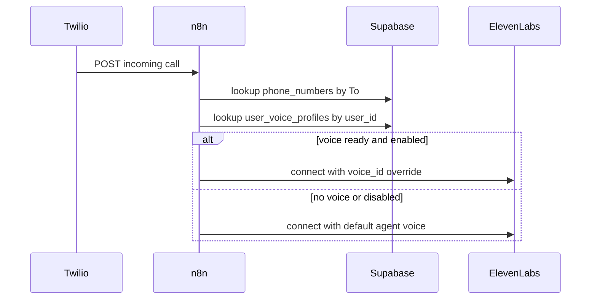

# Voice override por usuario en n8n

Cuando GhostLine atiende una llamada con el agente ElevenLabs, cada usuario debe hablar con **su** voz clonada. No se debe actualizar un agente global compartido (`ELEVENLABS_AGENT_ID`) con la voz del último usuario que completó onboarding.

## Fuente de verdad

Tabla `user_voice_profiles` en Supabase:

| Campo | Uso en llamada |
|-------|----------------|
| `elevenlabs_voice_id` | ID de voz para TTS del agente |
| `use_for_suspicious_calls` | Si `false`, usar voz por defecto del agente |
| `status` | Solo usar si `ready` (o `verification_required` según política) |
| `interaction_mode` | Futuro: ajustar prompt del agente (`prudente` / `equilibrado` / `detective`) |

Consulta (service_role):

```sql
select
  elevenlabs_voice_id,
  use_for_suspicious_calls,
  status,
  interaction_mode,
  display_name
from public.user_voice_profiles
where user_id = $1
  and deleted_at is null
limit 1;
```

## Flujo en `twilio-incoming-call`



### Pasos en n8n

1. Tras resolver `user_id` desde `phone_numbers`, consultar `user_voice_profiles`.
2. Si `status = 'ready'` y `use_for_suspicious_calls = true` y `elevenlabs_voice_id` no es null:
   - Pasar override de voz al conectar la conversación.
3. Si no hay perfil válido, conectar con la voz por defecto del agente (MVP sin clon).

## Override de voz en ElevenLabs Agents

El agente base (`ELEVENLABS_AGENT_ID`) debe tener habilitado en platform settings:

```json
{
  "platform_settings": {
    "overrides": {
      "conversation_config_override": {
        "tts": { "voice_id": true }
      }
    }
  }
}
```

Al iniciar la conversación (Twilio stream / signed URL), pasar el `voice_id` del usuario:

```json
{
  "conversation": {
    "tts": {
      "voice_id": "<elevenlabs_voice_id del usuario>"
    }
  }
}
```

> La forma exacta depende del conector Twilio ↔ ElevenLabs usado en n8n. Si el conector no soporta override dinámico, alternativa: **un agente ElevenLabs por usuario** creado en onboarding (más costoso; evitar en MVP salvo limitación del conector).

## Metadata recomendada en la conversación

Propagar en metadata de ElevenLabs (para post-call):

```json
{
  "clerk_user_id": "user_xxx",
  "call_sid": "CAxxx",
  "voice_profile_id": "uuid",
  "voice_override_applied": true
}
```

Esto permite auditar qué voz se usó en cada llamada.

## Borrado / revocación

Cuando el usuario llama `DELETE /api/voice-clone`:

1. Next.js elimina la voz en ElevenLabs (`DELETE /v1/voices/{voice_id}`).
2. Marca el perfil como `revoked` con `deleted_at`.
3. n8n debe tratar ausencia de perfil activo como “sin override”.

## Checklist n8n

- [ ] Nodo Supabase: `user_voice_profiles` por `user_id` tras lookup de número.
- [ ] Condición: `status = ready` AND `use_for_suspicious_calls = true`.
- [ ] Pasar `elevenlabs_voice_id` como override TTS al conectar agente.
- [ ] Agente base con `tts.voice_id` override habilitado en platform settings.
- [ ] Metadata de conversación incluye `clerk_user_id` y `voice_profile_id`.
- [ ] Post-call: no requiere cambios; transcripción/resumen siguen igual.

## Variables de entorno (n8n)

| Variable | Uso |
|----------|-----|
| `ELEVENLABS_API_KEY` | Ya usada para agente |
| `ELEVENLABS_AGENT_ID` | Agente base compartido |
| `SUPABASE_SERVICE_ROLE_KEY` | Leer `user_voice_profiles` |

Next.js no necesita exponer `elevenlabs_voice_id` al cliente salvo en onboarding/settings.
